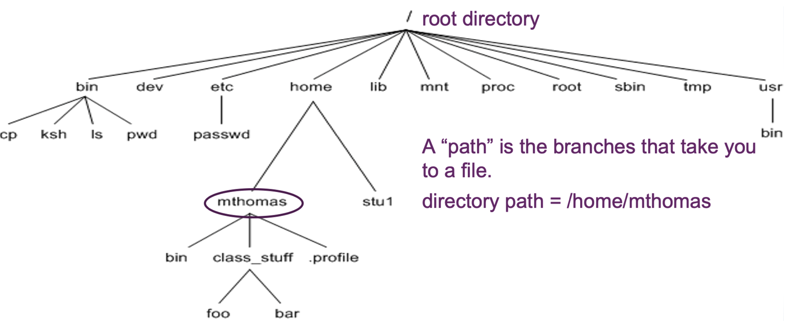
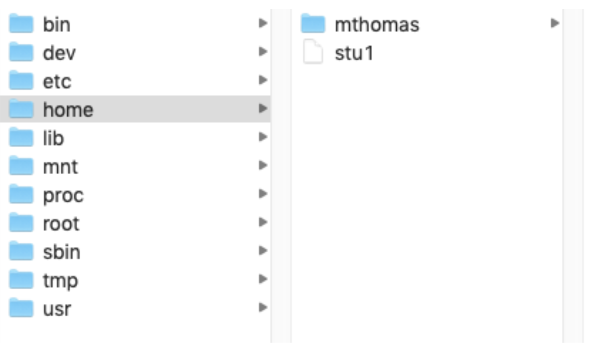

# Linux Basics

## Server Info

### What are the NCGR Server, Linux, and bash?

The **NCGR server** is a computer that has a large amount of computational power and memory at the National Center for Genome Resources (NCGR). We'll be working on this computer.

  + But it doesn't have a keyboard and monitor for you to interact with it. In the old days, a server would have a physical terminal (a workstation with a keyboard and monitor) physically attached to it so that you could send commands and receive output from the server.
  + These days we use terminal emulator apps, such as Tabby Terminal (https://tabby.sh/), instead of a physical terminal to interact with the server.

**Linux**: you can think of linux as the operating system on the server.

**bash**: Bourne-Again SHell (bash) is both a shell and command language

  + A shell is a user interface to the operating system, interpreting commands and sending them to the operating system to be run. bash is a command line interface (CLI), meaning you type in commands at the command line prompt (usually $ or %).
  + A command language provides programming syntax such as for loops or if/then statements that allow you to interact more effectively with the server.

### Terminal Emulator App

You should already have the Tabby terminal app installed. If not, please visit the "Installs" section.

+ For **Windows**: search for "Tabby" from the Start menu

+ For **Mac**: search for "Tabby" using Spotlight (the magnifying glass in the top right of your Mac screen)


## Connecting to the linux server

1. Open your terminal.

2. Type the following on your command line, substituting in your username for <username>. Your username is usually the first letter of your first name and your last name (all lowercase).

The 'ssh' command stands for "**s**ecure **sh**ell" and allows you to create a secure connection to the server.

+ The -p option is required to specify connection port 2403


```{bash, eval=FALSE}
ssh -p2403 <username>@inbre.ncgr.org
```

> **_NOTE:_** If you’re prompted to confirm the connection, say "yes".

3. Enter your password.

> **_NOTE:_** Your password will not show up when you type it but it is registering what you are typing.


You should now be on NCGR's analysis server!

You should see something like this:

+ agomez@de-2403:~$


### Change your password

```{bash, eval=FALSE}
passwd
```

Enter you current password then the new password when prompted.

## Directories

### Directory Structure{-}

{width=80%}

In a Finder window, you would see this:

{width=60%}


### Current directory

To find out which directory or folder you are in, type 'pwd' ("**p**rint **w**orking **d**irectory").

```{bash, eval=FALSE}
pwd
```

+ This is your "home" directory.

### Creating directories

Now, create a directory under your home directory to run linux commands in. Use the 'mkdir' ("**m**a**k**e **dir**ectory") command.

```{bash, eval=FALSE}
mkdir linux_practice
```

### List files and directories

You can see which files and directories are in the current directory using the 'ls' ("**l**i**s**t") command.

```{bash, eval=FALSE}
ls
```

Add some options to change the output.

+ **l**ong list

```{bash, eval=FALSE}
ls -l
```


+ **l**ong list, by **t**ime, **r**everse order (old to new)

```{bash, eval=FALSE}
ls -ltr
```

For most commands you can type the command and then --help to see options that you can use. Try that for "ls".

```{bash, eval=FALSE}
ls --help
```


### Navigation

Change directories into the new directory you made using the 'cd' command (**c**hange **d**irectory) then check what directory you are in.

> **_NOTE:_** '~' is shorthand for your home directory

```{bash, eval=FALSE}
cd ~/linux_practice

pwd
```


## Command History

The 'history' command lists the commands you have entered so far.

```{bash, eval=FALSE}
history
```

Redo a command from the list by number.

```{bash, eval=FALSE}
!17
```

Redo the last command you did.

```{bash, eval=FALSE}
!!
```

You can also scroll through recent commands using the up and down arrow.

Hit the up arrow until you get to the "cd ~/linux_practice". Then hit enter to execute it again.

## Files

### Redirect

By default, many commands print the output to the terminal screen, which you will see referred to as standard out or stdout.

You can use the redirect operator ("**>**") to redirect the output into a file.

Redirect the output of the history command into a file named "history.txt".
    
```{bash, eval=FALSE}
history > history.txt
```

Now you have a file with the commands you have run.

### Looking at files

There are many ways to look at the contents of a file. Let's use the "history.txt" file we just made.

> **_NOTE:_** These methods just allow you to look at the content of files, not edit them.

The 'cat' ("con**cat**enate) command will print the contents of the file to the screen.

> **_NOTE:_** You can feed in more than one file into the 'cat' command and it will concatenate the output of all the files together, hence the name.

```{bash, eval=FALSE}
cat history.txt
```

You can also use the '**more**' command, which will print the contents of the file to the screen one screenful at a time.

* Page through the output using the "space bar"
* Get out of it by typing "q"

```{bash, eval=FALSE}
more history.txt
```

In addition, the '**less**' command works as well.

* Use the arrows to navigate in the file
* To search, type "/" and the search term followed by enter
  * If more than one line has an instance of the search term, you can type "n" to go to the next one
* Get out of it by typing "q"

```{bash, eval=FALSE}
less history.txt
```


We will cover other ways to look at files ('head', 'tail', and 'column' commands) below.

### Tab completion

To autocomplete the remainder of a file (or directory) name instead of typing it all in:

+ cat h...(press tab)
    + cat history.txt
+ prevents typos and saves time

### Moving files

The 'mv' ("**m**o**v**e") command will allow you to move a file to a different name or location.

*Basic syntax*: mv [options] sourcefilename destinationfilename

```{bash, eval=FALSE}
mv history.txt history_file.txt

ls -l
```

### Copying files

The 'cp' ("**c**o**p**y) command duplicates a file.

*Basic syntax*: cp [options] sourcefilename destinationfilename

Make a backup copy of the history_file.txt file. Name the backup copy "history_bu.txt".

```{bash, eval=FALSE}
cp history_file.txt history_bu.txt
```

Check if the newly copied file is there

```{bash, eval=FALSE}
ls
```

### Removing files

To remove a file use the 'rm' (**r**e**m**oving) command.

*Basic syntax*: rm [options] filename

```{bash, eval=FALSE}
rm history_bu.txt
```

Check that it is gone.

```{bash, eval=FALSE}
ls -l
```


### Down/uploading files

The files you have created are on the NCGR computer. Sometimes you want to download those files onto your local computer or upload files from your computer to the server. We'll use FileZilla to do this. If you don't have FileZilla installed, please visit the "Installs" section.

Open FileZilla.

Change the connection from ftp (file transfer protocol) to sftp (ssh file transfer protocol).

+ In the menus, click File:Site Manager.

+ Click on "New Site".

+ Under protocol, choose "SFTP - SSH File Transfer Protocol.

+ Under host, type "inbre.ncgr.org".

+ Under host, type "2403".

+ Put in your username.

+ Click "Connect".

> **_NOTE:_** The first time you connect, you might get a popup about an "unknown host key". Click the box to "always trust this host" and click "OK".

Now you should be able to navigate to files on your local computer (left) and on the NCGR server (right). You can drag files between them.

> **_NOTE:_** if you create new files they won't show up until you hit the refresh button in FileZilla (blue and green circular arrows at the top of FileZilla).

Try to download your history file from the NCGR server (history_file.txt) that is in your ~/linux_practice directory.

You can right click on the downloaded file (left side of FileZilla) and choose "open" to open the file on your local computer.

> **_NOTE:_** Double-click transfers files instead of opening them.


## Abort commands

Sometimes you might need to stop a command:

+ You type a command and nothing happens; it hangs (this can happen when the syntax doesn’t make sense).
+ You want to stop a command early because you want to change something in the command.
+ Your command has sent a lot of output to the screen and you don't want to wait until it finishes (for instance, you might be looking at the contents of a file that is really large).


Hold "control" (CTRL) key while also typing the "c" key. 

Run a command that will hang. The command below will hang because the cat command needs a file name after it.

```{bash, eval=FALSE}
cat
```

Hit ctrl-c to stop it (you should see the prompt again).

### Symbolic links

Rather than copying a file you can make a link to it. This is especially useful if the file is large because the link is a pointer that uses almost no storage space. Here we will do a soft link (-s), which means that if the original file is ever deleted the link will break. A hard link (-h) is also possible, which means that if the original file is deleted it will be copied over to the link.

*Basic syntax*: ln [options] FileYouWantToLinkTo LinkName

Create a soft link to a fasta file with genome sequences of SARS-CoV-2 (the virus that causes COVID-19). Fasta files (ending .fasta or .fa) contain one or more DNA or RNA sequences. Each sequence begins with a **header** line that starts with ">". The header line is followed by one or more lines with sequence.

> **_NOTE:_** We'll take a shortcut using "." to indicate to name the link the same thing.

```{bash, eval=FALSE}
ln -s /home/data/linux/covid.fasta .
```

If you do a long list ('ls -l'), you will see an arrow (->) after the link name that points to the location of the file.

```{bash, eval=FALSE}
ls -l covid.fasta
```

We'll also use a file that has information about each viral isolate whose genome is in the "covid.fasta" file.

Try to make a soft link to the "viral_info.txt" file that is in the same directory as "covid.fasta".

## Looking at files again

### Head and tail

The '**head**' and '**tail**' commands give you the first or last 10 lines of a file, which can be handy for getting a glimpse into the contents of a file.

*Basic syntax*: head/tail [options] filename

Grab the beginning of a file.

```{bash, eval=FALSE}
head covid.fasta
```

Grab the end of the file.

```{bash, eval=FALSE}
tail covid.fasta
```


### Column

With all the methods for looking at a file that we have discussed so far, tab-delimited files can end up spaced in a way that is really hard to read.

Let's look at the information about the SARS-Cov-2 viral isolates. You should already have a soft link to the file ("virus_info.txt"). If not, create it now.

```{bash, eval=FALSE}
ln -s /home/data/linux/virus_info.txt .
```

Let's use head to get the first 30 lines and put it in a file called "30_virus_info.txt". The "-n" option will allow us to change the number of lines from the default of 10.

<!-- Doing this so the column header doesn't scroll off (and we can't pipe it into more or head because we haven't taught the students about pipes yet); also good practice for head -->

```{bash, eval=FALSE}
head -30 virus_info.txt > 30_virus_info.txt
```


Use 'more' to look at the file to see how the columns get shifted.

```{bash, eval=FALSE}
more 30_virus_info.txt
```

To make tab-delimited files easier to read, use the '**column**' command with the "-t" (table) option, which will make it look like a table. Let's start with a basic command.

```{bash, eval=FALSE}
column -t 30_virus_info.txt
```

By default it will create the table by splitting at all white space, which is a little more splitting that we need. But we can explicitly tell it to use a tab to split.

<!-- the "$" is an escape key, otherwise it will split at every t-->

```{bash, eval=FALSE}
column -t -s $'\t' virus_info.txt
```

## Characterizing files

### Count lines

The 'wc' ("word count") command gives calculates several counts for a file or other input. Here, we will focus on counting the number of lines with the "-l" option.

Count the number of lines in the covid.fasta file

```
wc -l covid.fasta
```

### Searching within files

The 'grep' ("**g**lobal, **r**egular **e**xpression, **p**rint") command will output the lines from a file that contain a provided expression.

*Basic syntax*: grep [options] expression filename

This command will get all the header lines (those beginning with ">") from the covid.fasta file.

```{bash, eval=FALSE}
grep ">" covid.fasta
```

Adding the "-c" option counts the number of lines containing a match 

+ **not** the number of matches!

```{bash, eval=FALSE}
grep -c ">" covid.fasta
```

The "-v" option reverses the grep search, grabbing only lines that do not have the expression. In this case, it will print out the sequence and not the header.

```{bash, eval=FALSE}
grep -v ">" covid.fasta
```

Use ctrl-c to halt the output.

You can limit the search to the beginning or end of the line using "^" or "$", respectively.

```{bash, eval=FALSE}
grep "^>" covid.fasta
```

### Subsetting columns

'awk' is a scripting tool that is very powerful. Here, we will use it to subset (and rearrange) columns but you will cover additional things that you can do with awk later in this workshop.

+ **A**ho, **W**einberger and **K**ernighan 
    + the authors of the language

General syntax:

+ awk 'pattern {action}' input-file
    + output goes to standard out=terminal
+ awk 'pattern {action}' input-file > output-file
    + or send to an output file

We'll practice with the "30_virus_info.txt" file.

* Grab the accession, length, and year (columns 1, 5, and 6)
* By default 'awk' splits on all whitespace (just like 'column') so we'll use the "-F" command to tell awk to split by tabs
* We'll separate the columns with tabs ("\t")

```{bash, eval=FALSE}
awk -F "\t" '{print $1 "\t" $5 "\t" $6}' 30_virus_info.txt
```

You can also rearrange columns.

* Grab the year, accession, and length.

```{bash, eval=FALSE}
awk -F "\t" '{print $6 "\t" $1 "\t" $5}' 30_virus_info.txt
```

In addition, you can use 'cut' to subset columns. By default, 'cut' uses tab as a delimiter (but you can change it with the "-d" option). However, you can't rearrange the columns.

* Grab the accession, length, and year (columns 1, 5, and 6).

```{bash, eval=FALSE}
cut -f 1,5-6 30_virus_info.txt
```

## The pipe operator

The pipe operator ("|") takes the output of one command and passes it as input into a second command.

Use the pipe operator to look at the first 10 headers in the covid.fasta file.

```
grep '>' covid.fasta | head
```

## Compressed files

Large files should be compressed so that they take up less space on the server.

We will use a file with DNA sequencing reads in it, which are usually delivered in fastq format and are compressed.

A fastq file has 4 lines per record:

+ The header; starts with "@"
+ The sequence
+ Throwaway line; begins with "+" (it originally was another instance of the header)
+ Phred-scaled quality scores

Copy the file to your directory.

```{bash, eval=FALSE}
cp /home/data/linux/SP1.fq.gz .
```


### Unzip

You can unzip the file using 'gunzip'.

```{bash, eval=FALSE}
gunzip SP1.fq.gz
```

You should now have a file called "SP1.fq" instead of "SP1.fq.gz". Check by listing the files that start with "SP1".

```{bash, eval=FALSE}
ls -ltr SP1*
```

### Zip

Let's zip it back up with the 'gzip' command, which results in a zipped file with its filename ending in ".gz".

```{bash, eval=FALSE}
gzip SP1.fq
```

You should now have a file called "SP1.fq.gz" instead of "SP1.fq". Check by listing the files that start with "SP1".

```{bash, eval=FALSE}
ls -ltr SP1*
```

### Reading zipped files

Unzipping and zipping everytime you want to use a compressed file is ineffecient. 

You can look at the contents of zipped files without unzipping them using the '**z**cat' command. This does the same thing as 'cat' except that it works on **z**ipped files.

Look at the first 10 lines.

```{bash, eval=FALSE}
zcat SP1.fq.gz | head
```

### Searching zipped files

You can also search zipped files without unzipping them using the '**z**grep' command. This is simply the version of grep used for zipped files.

Find the first 10 header rows.

> **_NOTE:_** Header rows start with "@" but "@" can also show up in the quality line, including at the beginning so it is best to search for something specific to the header line. In this case our header lines all start with "@cluster".

```{bash, eval=FALSE}
zgrep '^@cluster' SP1.fq.gz | head
```


## Loops

Suppose we want to run a command for a **group of files** in a directory. We can use a for loop to target all of them at once. We will do a simple example using the 'echo' command, which will print something to the screen (but you will see more complex examples later in this workshop).

Syntax: for variablename in filenameexpression; do command ${variablename}; done

```{bash, eval=FALSE}
for file in *; do
  echo "File:" ${file};
done
```

```{bash, eval=FALSE}
## covid.fasta
## newfile.txt
## SP1.fq
## table1.txt
## table2.txt
```

+ The part up to the first semicolon targets every file in the working directory with the "*" wildcard
+ The second part will sequentially echo each file in the working directory 
+ The third part is required to terminate the loop


## Screen

<!--screen -S my_session_name -X quit-->

The 'screen' command keeps your commands from crashing if you get disconnected from the server. It also is a "terminal multiplexer" that creates multiple windows within your terminal so that you can have multiple processes running that you can quickly switch between.

You should get in the habit of working in a screen.

Common 'screen' commands and keyboard shortcuts:

+ Create a screen

The -S allows you to name the screen. We'll call ours "expr".

```
screen -S expr
```

Now you are in a screen and can run commands that will continue even if you disconnect from the server.

+ **C**reate an additional window in the screen.

```
CTRL-a + c
```

You can do this multiple times if you want more windows.

+ **N**ext window

Go to the next window (based on the order the windows were made)

```
CTRL-a + n
```

+ **P**revious window

Go to the previous window (based on the order the windows were made)

```
CTRL-a + p
```

+ Last used window

Go to the last used window

```
CTRL-a + a
```

+ **D**etach from a screen

Get out the screen (but your screen and any processes in it are still running).

```
CTRL-a + d
```

+ List screens

**List** all the screens that are running.

```
screen -list
```

+ **R**eattach to a screen and **d**etach if attached elsewhere

This will allow you to reconnect with a screen. It will detach from the screen if you are attached elsewhere before reattaching. Being attached elsewhere can happen if you lost internet connection or power to your computer (and, therefore, lost server connection) or if you closed your terminal without detaching.

```
screen -rd singlecell
```

More information for screen and keyboard shortcuts are here: https://www.geeksforgeeks.org/linux-unix/screen-command-in-linux-with-examples/


## Exercises


