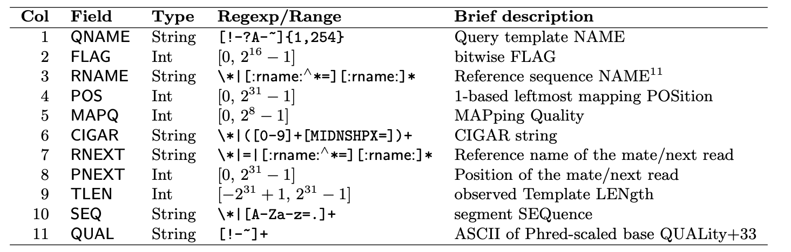

---
output:
  pdf_document: default
  html_document: default
---
# Read Alignment

## Reference acquisition

Create a new directory named "genome" **within the DGE_workshop directory**

<span style="color:red">**MAKE SURE YOUR ARE IN THE CORRECT DIRECTORY BEFORE YOU MAKE THIS DIRECTORY**</span>

```{bash, eval=FALSE}
mkdir genome
```


Download the appropriate genome and annotation files to align our 6 sample sequence files to.  

How do you know what genome and annotation file to get in this case?  

What do we know about our sample sequences?  

What organism did the samples come from?  


Download the files from this page:  
https://ftp.ncbi.nlm.nih.gov/genomes/refseq/vertebrate_mammalian/Mus_musculus/latest_assembly_versions/GCF_000001635.27_GRCm39/

What is Mus musculus?  

Use wget command to dowload files using a link:
```{bash, eval=FALSE}
wget https://ftp.ncbi.nlm.nih.gov/genomes/refseq/vertebrate_mammalian/Mus_musculus/latest_assembly_versions/GCF_000001635.27_GRCm39/GCF_000001635.27_GRCm39_genomic.fna.gz
```

What type of file did you just download?  

What do you know about this file format?  

Use wget command to dowload files using a link:
```{bash, eval=FALSE}
wget https://ftp.ncbi.nlm.nih.gov/genomes/refseq/vertebrate_mammalian/Mus_musculus/latest_assembly_versions/GCF_000001635.27_GRCm39/GCF_000001635.27_GRCm39_genomic.gff.gz
```

Because we know that we downloaded a **genome file**  
and an **annotation file**, what must the file we downloaded above be?

What is the extension for an annotation file?

## HISAT2

Unzip your genome.gz file:  
```{bash, eval=FALSE}
gunzip GCF_000001635.27_GRCm39_genomic.fna.gz
```


Activate the hisat2 environment:  
```{bash, eval=FALSE}
conda activate hisat2
```


Use the program HISAT2 to create indices:  

<span style="color:red">Time will not allow for us to complete this command, so we will cancel the command after checking it works.</span>
```{bash, eval=FALSE}
hisat2-build -p 10 GCF_000001635.27_GRCm39_genomic.fna GRCm39.index
```

Make the output directory that your newly-created alignment files will be saved to.  

This directory will be called "alignments" and <span style="color:red">**MUST BE IN YOUR DGE_workshop DIRECTORY**</span>

Again, if your directories and paths are incorrect, the following commands will not work.

Why won't they work?

From the correct directory, make a directory called alignments:
```{bash, eval=FALSE}
mkdir alignments
```

From the **reads directory** run the hisat command to generate alignments.  

What file is your index file?  
How do you know?  

What files are the sample sequence files?  
How many sample sequence files are we aligning to the index?  

<span style="color:red">What directory are you in?</span>  

If you're not in the reads directory, will this command work?  
Why not?   

Run hisat to align fastq files to the genome index:
```{bash, eval=FALSE}
for file in *.fastq.gz; do
  hisat2 -x ~/DGE_workshop/genome/GRCm39.index --threads 10 -U "${file}" -S ~/DGE_workshop/alignments/"${file}.sam"
done
```

What option in the command above indicates that we want to use a setting for single-end reads?  


What option would you use for paired-end reads?  


What are single-end vs. paired-end reads?  


## .sam format  
 
What kind of information does the first 11 columns of a .sam file contain?

{width=100%}

## Cigar string  

What is a Cigar string?

{width=100%}

## Alignment metrics

Some alignment tools (HISAT2 for example) will print alignment metrics after generating alignments. However, these metrics may not be available as a result of other alignment tools. Hence, it is useful to know the following one-liners to extract information on important metrics from SAM files. 

Change environments and use this statistics summarization command. It takes about a minute per sample.

```{bash, eval=FALSE}
conda deactivate
conda activate samtools

samtools flagstat SRR23869771.fastq.fastp.gz.sam
```

The number in the first row is the count of records in the .sam file. Confirm this by counting the rows not including the header lines.

```{bash, eval=FALSE}
grep -v "^@" SRR23869771.fastq.fastp.gz.sam
```

Secondary alignments counts the alignments of reads that mapped to additional locations on the genome. To omit these, Count the number of unique read IDs in the file.

```{bash, eval=FALSE}
grep -v "^@" SRR23869771.fastq.fastp.gz.sam | awk '{print $1}' | uniq | wc -l
```

Check this with arithmatic from the flagstat output: 38991995 - 14794600

However, this count also includes reads which didn't map at all. Filter those out ("*" in column 3) to find the number of reads that mapped once or more. 

```{bash, eval=FALSE}
cat SRR23869771.fastq.fastp.gz.sam | grep -v '^@' | awk '{ if ($3 != "*") print $0}' | awk '{print $1}' | uniq | wc -l
```

The " mapped" number from the flagstat output counts all alignments (not reads!) Subtract the secondary alignments from that value to check our result:
35942177 - 14794600

As it happens, there is another convenient samtools function to extract the desired metrics from # a .sam file.

{width=100%}

```{bash, eval=FALSE}
samtools view -f 0x100 -c SRR23869771.fastq.fastp.gz.sam 
```

Including the "-f" option in the samtools "view" command will print to stdout the records matching the corresponding bit flag shown in the table below. This command, for example, counts (due to the inclusion of the "-c" option) all secondary reads. Notice it matches the number found with the other methods.

The "-F" option is similar to grep's "-v" option; it pulls the OPPOSITE records from what the bit flag describes. Moreover, these bit flags can be combined- e.g., 904 = 800 + 100 + 4
Therefore, the number of primary alignments can also be found by:

```{bash, eval=FALSE}
samtools view -F 0x904 -c SRR23869771.fastq.fastp.gz.sam 
```

Note that this is less than the total number of reads in our file. This operates in an "or" fashion. If we run the above command with "-f", it yields 0, because the postive search runs in an "and" fashion.

Exercise: Select another sample, and using any of the means above, determine 1) Total read count 2) Total mapped reads 3) Total primary alignments

## .sam/.bam conversion and alignment sorting

```{bash, eval=FALSE}
for file in *.sam; do samtools view -u ${file} | samtools sort -o ${file}.sorted; done
```

Rename the output files

```{bash, eval=FALSE}
file-rename -- 's/\.fastq.fastp.gz.sam.sorted$/.sorted.bam/' *.sorted
```

Exercise: What average genome coverage do our primary alignments give us?

Download the 6 read pairs from this study: https://www.ncbi.nlm.nih.gov/Traces/study/?acc=SAMN00849440&o=acc_s%3Aa

This is a yeast study comparing growth in two different conditions (https://www.ncbi.nlm.nih.gov/pmc/articles/PMC3488244/).

Take them through the steps of the workflow up until now.


