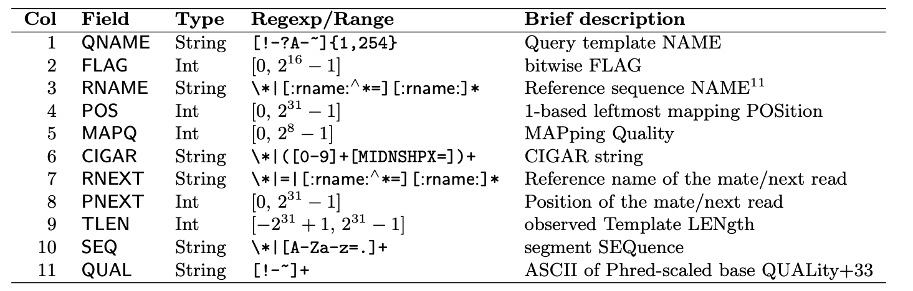
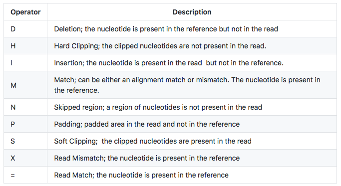

---
output:
  pdf_document: default
  html_document: default
---
# Read Alignment

## Reference acquisition

Create a new directory under DGE_workshop
```{bash, eval=FALSE}
mkdir genome
```

From this page: https://ftp.ncbi.nlm.nih.gov/genomes/refseq/vertebrate_mammalian/Mus_musculus/latest_assembly_versions/GCF_000001635.27_GRCm39/
Download the appropriate genome and annotation.

```{bash, eval=FALSE}
wget https://ftp.ncbi.nlm.nih.gov/genomes/refseq/vertebrate_mammalian/Mus_musculus/latest_assembly_versions/GCF_000001635.27_GRCm39/GCF_000001635.27_GRCm39_genomic.fna.gz

wget https://ftp.ncbi.nlm.nih.gov/genomes/refseq/vertebrate_mammalian/Mus_musculus/latest_assembly_versions/GCF_000001635.27_GRCm39/GCF_000001635.27_GRCm39_genomic.gff.gz
```

## HISAT2

Activate environment, and use HISAT2 to create indices. If time prohibits, we will likely need to terminate and softlink to output files.

```{bash, eval=FALSE}
source activate hisat2

hisat2-build -p 10 GCF_000001635.27_GRCm39_genomic.fna GRCm39.index
```

From the reads directory, run alignments

```{bash, eval=FALSE}
for file in *.fastp.gz; do hisat2 -x /home/$USER/DGE_workshop/genome/GRCm39.index --threads 10 -U ${file} -S /home/$USER/DGE_workshop/alignments/${file}.sam; done
```

What flags would you use for paired-end reads? 

## .sam format

{width=100%}
## Cigar string

{width=100%}

## Alignment metrics

Some alignment tools (HISAT2 for example) will print alignment metrics after generating alignments. However, these metrics may not be available as a result of other alignment tools. Hence, it is useful to know the following one-liners to extract information on important metrics from SAM files. 

Change environments and use this statistics summarization command. It takes about a minute per sample.

```{bash, eval=FALSE}
samtools flagstat SRR23869771.fastq.fastp.gz.sam
```

The number in the first row is the count of records in the .sam file. Confirm this by counting the rows not including the header lines.

```{bash, eval=FALSE}
grep -v "^@" SRR23869771.fastq.fastp.gz.sam
```

Secondary alignments counts the alignments of reads that mapped to additional locations on the genome. To omit these, Count the number of unique read IDs in the file.

```{bash, eval=FALSE}
grep -v "^@" SRR23869771.fastq.fastp.gz.sam | awk '{print $1}' | uniq | wc -l
```

Check this with arithmatic from the flagstat output: 38991995 - 14794600

However, this count also includes reads which didn't map at all. Filter those out ("*" in column 3) to find the number of reads that mapped once or more. 

```{bash, eval=FALSE}
cat SRR23869771.fastq.fastp.gz.sam | grep -v '^@' | awk '{ if ($3 != "*") print $0}' | awk '{print $1}' | uniq | wc -l
```

The " mapped" number from the flagstat output counts all alignments (not reads!) Subtract the secondary alignments from that value to check our result:
35942177 - 14794600

As it happens, there is another convenient samtools function to extract the desired metrics from # a .sam file.

{width=100%}

```{bash, eval=FALSE}
samtools view -f 0x100 -c SRR23869771.fastq.fastp.gz.sam 
```

Including the "-f" option in the samtools "view" command will print to stdout the records matching the corresponding bit flag shown in the table below. This command, for example, counts (due to the inclusion of the "-c" option) all secondary reads. Notice it matches the number found with the other methods.

The "-F" option is similar to grep's "-v" option; it pulls the OPPOSITE records from what the bit flag describes. Moreover, these bit flags can be combined- e.g., 904 = 800 + 100 + 4
Therefore, the number of primary alignments can also be found by:

```{bash, eval=FALSE}
samtools view -F 0x904 -c SRR23869771.fastq.fastp.gz.sam 
```

Exercise: Select another sample, and using any of the means above, determine 1) Total read count 2) Total mapped reads 3) Total primary alignments

## .sam/.bam conversion and alignment sorting

```{bash, eval=FALSE}
for file in *.sam; do samtools view -u ${file} | samtools sort -o ${file}.sorted; done
```

Rename the output files

```{bash, eval=FALSE}
rename .fastq.fastp.gz.sam.sorted .sorted.bam *.sorted
```

Exercise: What average genome coverage do our primary alignments give us?


