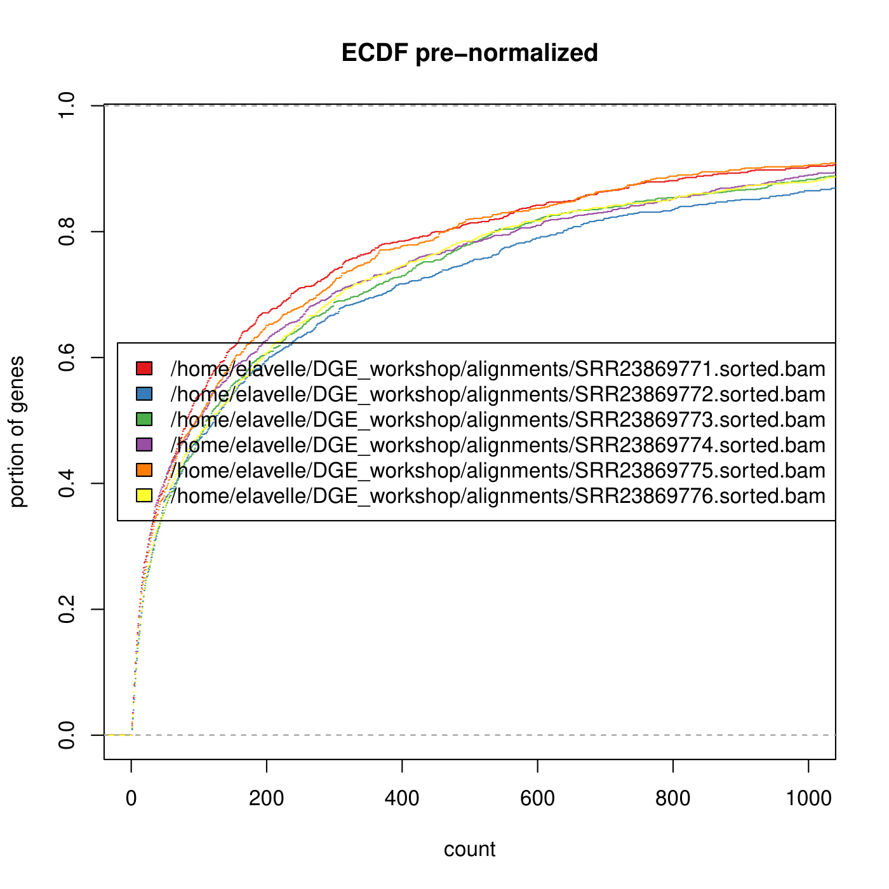
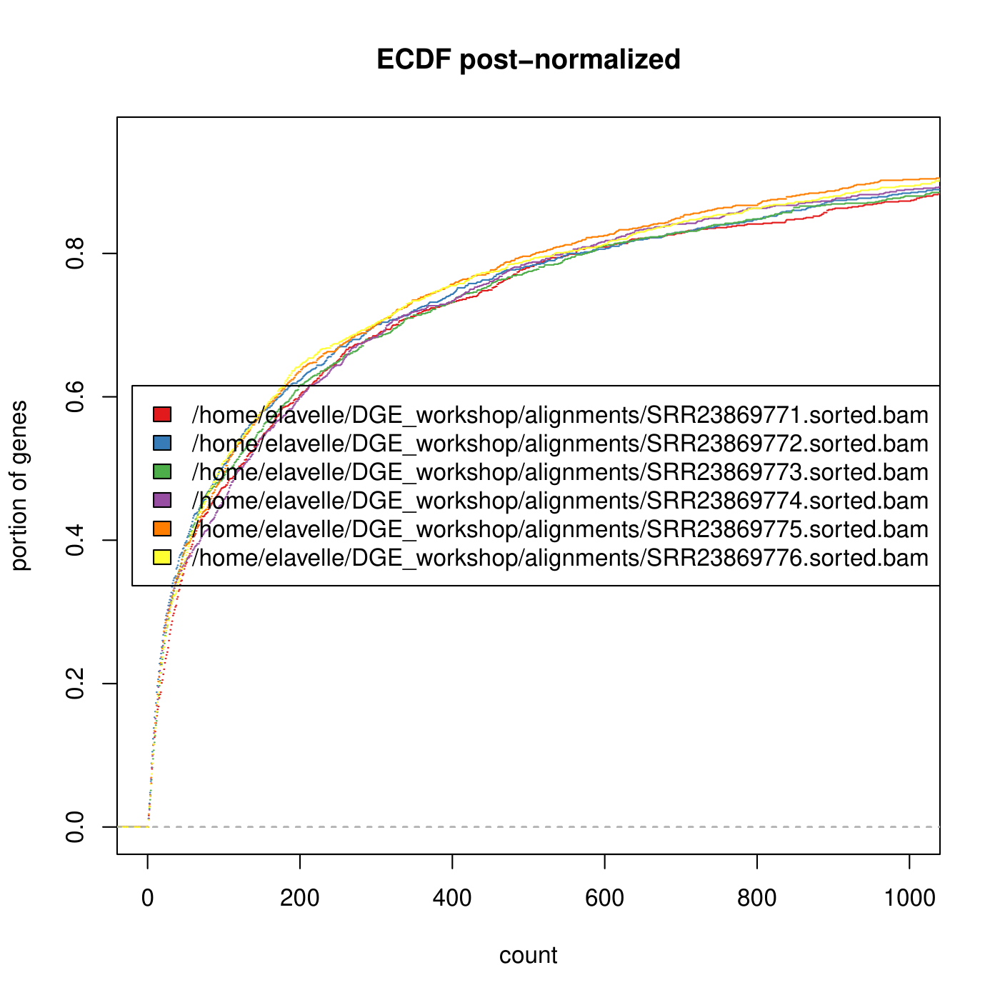
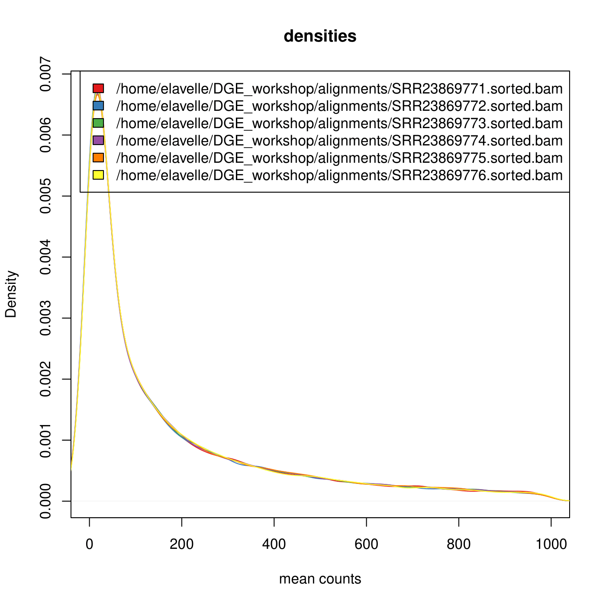
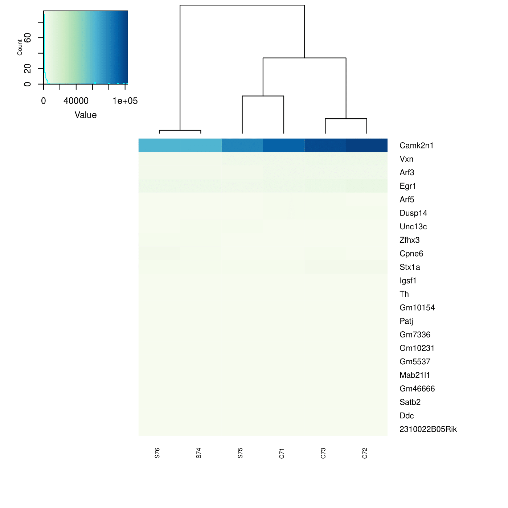
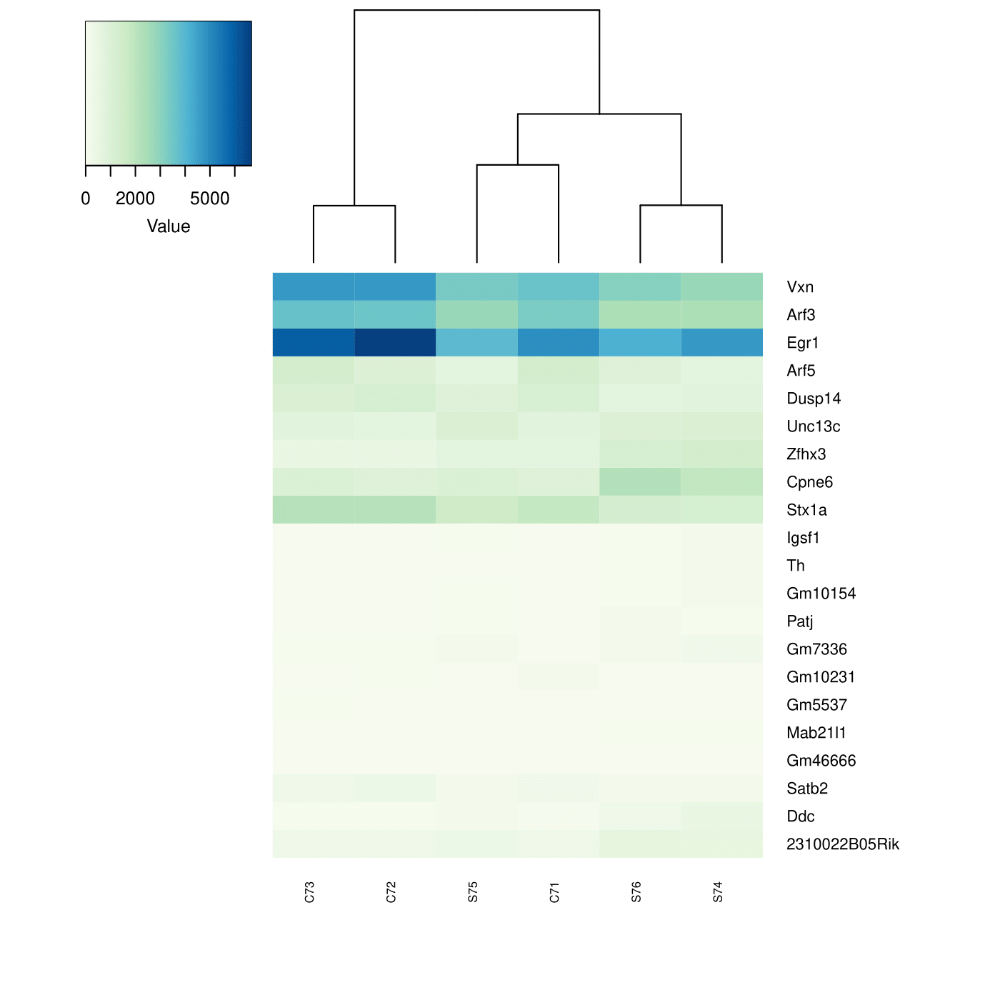
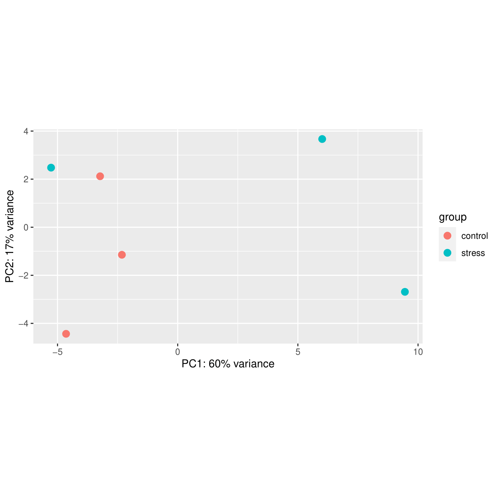
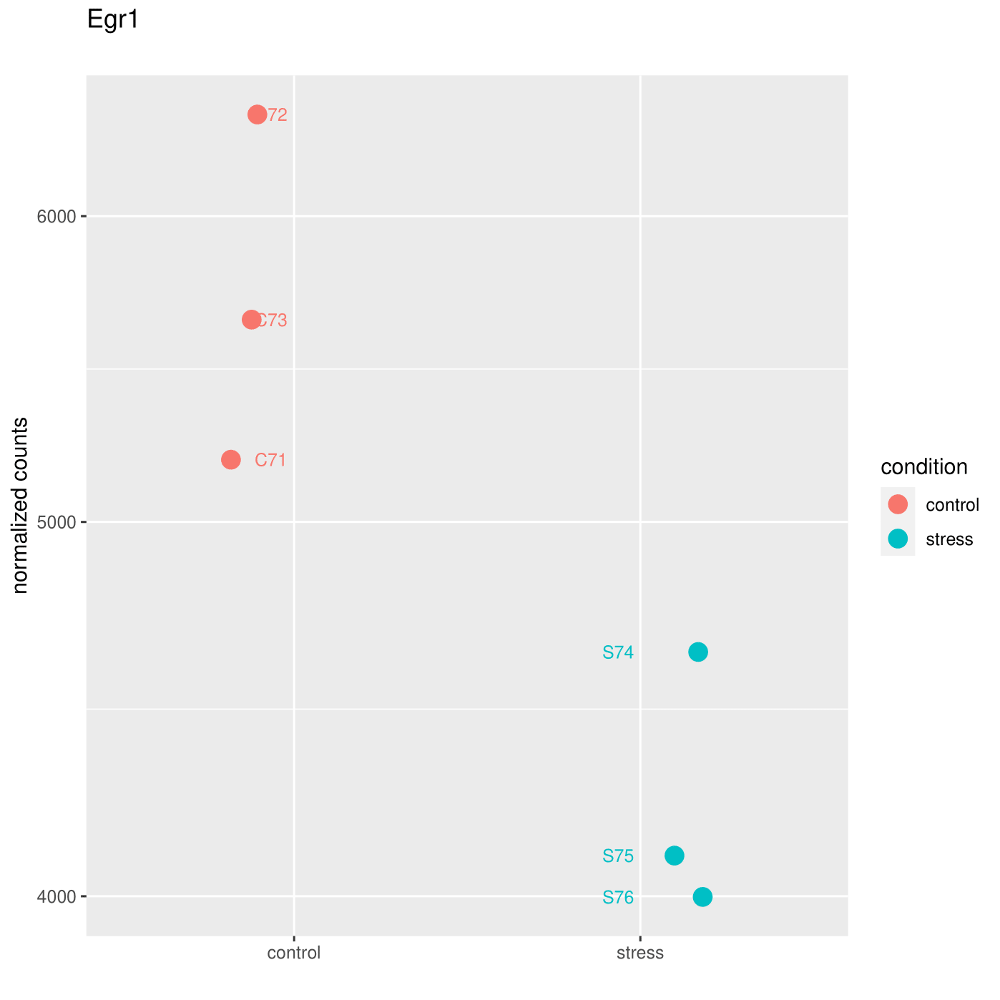

---
output:
  pdf_document: default
  html_document: default
---
# Differential Gene Expression Analysis

## R data import

Launch R from the DESeq2 directory.
```{bash, eval=FALSE}
R
```

You are now in the R environment. Load the DESeq2 library.

<!-- Note that we are using /usr/bin/R and don't need to activate an environment. There is also an R installed in the vis environment. -->

```{R, eval=FALSE}
library(DESeq2)
```

You shouldn't need to change the working directory, but you can check it with:

```{R, eval=FALSE}
getwd()
```

and change it with:

```{R, eval=FALSE}
setwd('~/DGE_workshop/DESeq2/')
```

Load the table we made with featureCounts into a variable, then check the dimensions.

```{R, eval=FALSE}
sampleCounts <- read.table("DESEQ2_matrix.tsv", header = TRUE, row.names = 1, check.names=FALSE)

dim(sampleCounts)
```

## Format metadata

Specify sample conditions. As the experimental design only incorporates two levels of a single factor, our table will be very simple. Nonetheless, it is important to create this accurately, as it is what the software will use to make comparisons.

```{bash, eval=FALSE}
sampleCondition <- as.factor(c(rep("control",3),rep("stress",3)))
sampleTable <- data.frame(condition=sampleCondition)
``` 

Prepare the DESeq2-specific object.

```{R, eval=FALSE}
DESeqDataset <- DESeqDataSetFromMatrix(countData=sampleCounts, colData=sampleTable, design=~condition)
``` 

Optional step 1: Count genes with totals > 0 across all samples.

```{R, eval=FALSE}
GeneCounts <- counts(DESeqDataset)
idx.nz <- apply(GeneCounts,1,function(x){all(x>0)})
sum(idx.nz)
``` 

Optional step 2: Generate library size normalization factors.

```{R, eval=FALSE}
DESeqSF <- estimateSizeFactors(DESeqDataset)
sizeFactors(DESeqSF)
``` 

<!--Optional because DESeq2 will estimate these size factors if you don't-->

## Normalization

Load the library for plotting densities.

```{R, eval=FALSE}
library(geneplotter)
``` 

We "declare" the .pdf first, then run the plot command.  
dev.off() is necessary to close the .pdf

Note that ECDF stands for "Estimator of the Cumulative Distribution Function".

<!--Note that the ECDF plots come out slightly different every time-->

```{R, eval=FALSE}
pdf("count_density_prenorm.pdf")
multiecdf(counts(DESeqSF, normalized=F)[idx.nz,],main="ECDF pre-normalized", xlab="count", ylab="portion of genes", xlim=c(0,1000))
dev.off()
```

{width=100%}

\vspace{12pt}

Now we'll make a normalized one for comparison.

```{R, eval=FALSE}
pdf("count_density_postnorm.pdf")
multiecdf(counts(DESeqSF, normalized=T)[idx.nz,],main="ECDF post-normalized", xlab="count", ylab="portion of genes", xlim=c(0,1000))
dev.off()
```

{width=100%}

Let's generate similar multidensity plots.

```{R, eval=FALSE}
pdf("multidensity_prenorm.pdf")
multidensity(counts(DESeqDataset, normalized=F)[idx.nz,],xlab="mean counts", xlim=c(0,1000))
dev.off()
``` 

{width=100%}

```{R, eval=FALSE}
pdf("multidensity_postnorm.pdf")
multidensity(counts(DESeqSF, normalized=T)[idx.nz,],xlab="mean counts", xlim=c(0,1000))
dev.off()
``` 

{width=100%}
## DESeq2

Designate reference level for each factor

```{R, eval=FALSE}
colData(DESeqDataset)$condition <- relevel(DESeqDataset$condition, "control")
```
Run DESeq2
```{R, eval=FALSE}
dds <- DESeq(DESeqDataset)
resultsNames(dds)
```

The "results" function pulls the last comparison in the results list. Provide an independent filtering variable equivalent to the study's false discovery rate.

```{R, eval=FALSE}
stress_from_control <- results(dds, alpha=0.05)
summary(stress_from_control)
```

There are a few ways to extract comparisons from the results object.
What is different about this method?

```{R, eval=FALSE}
control_from_stress <- results(dds, contrast=c("condition","control","stress"), alpha=0.05)
summary(control_from_stress)
```

Sort our results table by padj.

```{R, eval=FALSE}
stress_from_control_sorted <- stress_from_control[order(stress_from_control$padj),]
```

Take a look at the column names.

```{R, eval=FALSE}
colnames(stress_from_control_sorted)
```


Now, let's grab the rows where padj <= 0.05. There are lots of ways to do this. Let's use the subset function.

```{R, eval=FALSE}
stress_from_control_sorted_sub = subset(stress_from_control_sorted, padj <= 0.05)
```

Finally, let's export a file with counts appended to it.

```{R, eval=FALSE}
write.table(merge(as.data.frame(stress_from_control_sorted_sub),as.data.frame(counts(dds,normalized=TRUE)), by="row.names"), row.names=FALSE, quote=FALSE, sep="\t", file="SfromC.tsv")
```


## Heatmap

Load libraries for heatmap and subset our results.

```{R, eval=FALSE}
library(RColorBrewer)
library(gplots)
sigIndices <- which(stress_from_control$padj <= 0.05)
sigIndices
```

Create object to feed into the plot, set colors.

```{R, eval=FALSE}
plotCounts <- counts(dds[sigIndices,])
colnames(plotCounts) <- c("C71","C72","C73","S74","S75","S76") 
hmcol <- colorRampPalette(brewer.pal(9,"GnBu"))(100)
```

Make it!

```{R, eval=FALSE}
pdf ("heatmapSigs.pdf")
heatmap.2(plotCounts,  col=hmcol, cexRow=0.8,
          key.title = NA, scale="none", dendrogram="col", 
          trace="none", density.info='histogram', cexCol=0.6, margin=c(6,10))
dev.off()
```

{width=100%}

Camk2n1 is skewing the color palette. Let's make a version omitting it.
```{R, eval=FALSE}
pdf ("heatmapSigsMost.pdf")
heatmap.2(plotCounts[-5,],  col=hmcol, cexRow=0.8,
          key.title = NA, scale="none", dendrogram="col", 
          trace="none", density.info='none', cexCol=0.6, margin=c(6,10))
dev.off()
```


{width=100%}


<!-- Not sure why the figure above renders in a scrollable container. -->

If we want the same decreasing order:
```{R, eval=FALSE}
# Sorts, removes Camk2n1
sorted <- row.names(data.frame(sort(rowMeans(plotCounts), decreasing=TRUE)))[-1]
# makes new dataframe with these indeces
new_counts <- plotCounts[match(sorted, row.names(plotCounts)),]

pdf ("heatmapSigsMost.pdf")
heatmap.2(new_counts,  col=hmcol, cexRow=0.8,
          key.title = NA, scale="none", dendrogram="col", 
          trace="none", density.info='none', cexCol=0.6, margin=c(6,10), Rowv=FALSE) 
dev.off()
```


{width=100%}


\vspace{12pt}

Principal Component Analysis now.
```{R, eval=FALSE}
rld <- rlogTransformation(dds,blind=TRUE)
pdf("PCA.allsamples2.pdf")
plotPCA(rld,intgroup=c("condition"))
dev.off()
```

{width=100%}
<!--
## Gene count plots

This last command will put a lot together. Let's discuss:  
loop iterations  
aesthetic layers  
x-axis labels  
jittering

```{R, eval=FALSE}
library('ggplot2')

for(k in 1:length(sigIndices)) {  
  gene <- rownames(stress_from_control_sorted)[k]
  pval <- format(stress_from_control_sorted$padj[k], digits=4)
  
  d <- plotCounts(dds, gene=gene, # replaced = TRUE, 
                  intgroup = c("condition"), 
                  returnData = TRUE)
  p <- ggplot(d, aes(x=condition, y=count,
                     color=condition)) +
    geom_point(position=position_jitter(w=0.2, h=0), 
               alpha=100/100, size=3, stroke=1.25) + 
    scale_y_log10() + geom_text(aes(label=colnames(plotCounts)), hjust=+1.2, size=3) +
    ylab("normalized counts") +
    xlab("") +
    labs(title=paste0(gene), 
         subtitle = "")
  
  ggsave(paste(gene,".pdf",sep=""))
}
dev.off()
```

You should get 18 pdf files, one for each of the differentially expressed genes. One is shown below.

{width=100%}
-->
