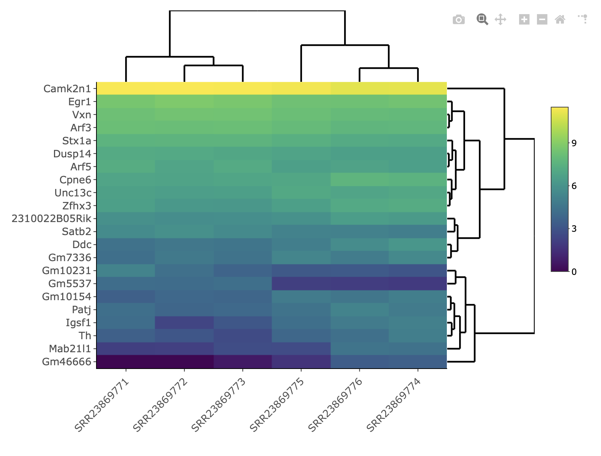

---
output:
  pdf_document: default
  html_document: default
---
# Additional visualization

## Graphing with ggplot2

Handy gglot2 references:

• ggplot2 gallery

– http://www.r-graph-gallery.com/portfolio/ggplot2-package/

• ggplot2 cheatsheets

– http://ggplot2.tidyverse.org/reference/

• ggplot2 documentation

– https://cran.r-project.org/web/packages/ggplot2/ggplot2.pdf

## Data and setup

Reconnect to the DGE analysis screen.

If you haven't already done so, activate the environment, open R, and load the ggplot2 library.
```{R, eval=FALSE}
source activate visualization

R
library(ggplot2)
```

```{R, eval=FALSE}
expr = read.table("SfromCcomplete.tsv", header = TRUE)
head(expr)
```

## Scatter plots

Let's compare replicates 1 and 2 for the control.

Treatment (Brain water avoidance stress, 1 hr)
Rep 1: SRR23869776
Rep 2: SRR23869775
Rep 3: SRR23869774

Control
Rep 1: SRR23869773
Rep 2: SRR23869772
Rep 3: SRR23869771

The aesthetics (aes) map variables onto parts of the plot. In this case, the x and y axes. We'll put the plot into a variable then print the variable. Later on this will be valuable because we can add onto plots without regenerating them. We'll print the plot to a pdf file. Alpha makes the points transparent so that it is easier to see when you have a lot of points in the same place on the graph.

```{R, eval=FALSE}
pdf("expression_replicates.pdf")

scatexpr = ggplot(expr, aes(x=SRR23869772, y=SRR23869773)) + geom_point(alpha=0.2)

scatexpr

dev.off()
```

{width=100%}

Now let's add some color based on the padj values. Because padj is on a continuous scale, ggplot2 will give us a scale for color. If we had used a qualitative variable it would give us discrete colors.

```{R, eval=FALSE}
pdf("expression_replicates2.pdf")

scatexpr2 = ggplot(expr, aes(x=SRR23869772, y=SRR23869773, color=padj)) + geom_point(alpha=0.2)

scatexpr2

dev.off()
```
{width=100%}

Exercise: Compare two other reps.

Let's compare the averages of the treatment to the averages of the controls. We can add new columns and calculate the means. Note that the dollar sign after the data frame name signifies a column. The square brackets after the data frame name signifies rows and columns. Since we left the row blank it will calculate the averages row by row across the designated columns.

```{R, eval=FALSE}

expr$ControlAverage <- rowMeans(expr[ , c(8:10)])
expr$TreatmentAverage <- rowMeans(expr[ , c(11:13)])

```

Exercise: Create a scatterplot between the treatment and control averages that you just made.

```{R, eval=FALSE,echo=FALSE}
pdf("expression_replicates_averages.pdf")

scatexpr3 = ggplot(expr, aes(x=ControlAverage, y=TreatmentAverage, color=padj)) + geom_point(alpha=0.2)

scatexpr3

dev.off()
```

{width=100%}


## Volcano plot

We can even make a volcano plot in ggplot2, which is really just a specialized scatter plot. The x axis is the log2 of the fold change (Fold_Change). This transformation creates the symetrical “V” shape of the Volcano Plot. The y axis is the negative log10 of the p value (padj), which makes lower number (more significant) higher on the plot. We'll also add a line at p=0.05 (on the graph this will be -log10(p)=1.3). Those above the line are significant. We'll color by padj. This time, we'll add layers to the base graph we put in the “volcano” variable rather than redoing the graph from scratch.

```{R, eval=FALSE}
neglog10padj = -log10(expr$padj)
volcanoDF = data.frame(lg2FC = expr$log2FoldChange, negLG = neglog10padj, padj= expr$padj)
```

```{R, eval=FALSE}
pdf ("volcano.pdf")
volcano1 = ggplot(volcanoDF, aes(x=lg2FC, y=negLG, color = padj)) +
  geom_point() +
  geom_hline(yintercept=1.3, color='gray') +
  xlab("log2(Fold Change)") +
  ylab("-log10(Adjusted p value)") +
  ggtitle("Volcano Plot")
volcano1
dev.off()
```
{width=100%}

And now, let's play with the colors. We will color by the log2(Fold Change) instead of padj. We'll use a more recent color scheme, viridis (purple to yellow) which is gaining traction in gene expression circles. According to the developers (https://cran.r-project.org/web/packages/viridis/vignettes/intro-to-viridis.html), it was developed to be:

• Colorful, spanning as wide a palette as possible so as to make differences easy to see

• Perceptually uniform, meaning that values close to each other have similar-appearing colors and values far away from each other have more different-appearing colors, consistently across the range of values

• Robust to colorblindness, so that the above properties hold true for people with common forms of colorblindness, as well as in grey scale printing, and

• Pretty, oh so pretty
 
scale_color_gradient2(low = "blue", mid = "white", high = "red")

```{R, eval=FALSE}
pdf ("volcanoimproved.pdf")
volcano_viridis = ggplot(volcanoDF, aes(x=lg2FC, y=negLG, color = lg2FC)) +
  geom_point() +
  geom_hline(yintercept=1.3, color='gray') +
  xlab("log2(Fold Change)") +
  ylab("-log10(Adjusted p value)") +
  ggtitle("Volcano Plot") +
  scale_color_viridis_c()
volcano_viridis
dev.off()
```

{width=100%}

## Boxplots

In expression data, you often want to print a boxplot of some of your interesting genes based on differential expression and/or the biology of the gene. They show the mean and the interquartile range. The whiskers go to the farthest distal value from the nearest quartile that is no farther than 1.5 * IQR beyond the nearest quartile. Any outliers are plotted as individual dots. 

Let's take a closer look at that gene that stood out before (Camk2n1).

First, get the row for the Camk2n1 gene using the subset command.
```{R, eval=FALSE}

df_camk2n1 = subset(expr, Row.names == "Camk2n1")

```

Now grab the columns (8-13) with the replicate data and transpose them (t). Note that we are using the same variable name. The transpose command turns it into a matrix but we need a data frame, so we'll wrap everything in the as.data.frame command to keep it as a data frame.

```{R, eval=FALSE}

df_camk2n1 = as.data.frame( t(df_camk2n1[,8:13]) )

# Take a look at it
df_camk2n1

```


```{R, eval=FALSE}
                  30 
SRR23869771 96840.79 
SRR23869772 98702.66 
SRR23869773 93495.25 
SRR23869774 62737.18 
SRR23869775 83620.25 
SRR23869776 61241.84
```

Right now the column header is 30, referring to the original row number for Camk2n1, rather than the gene name. Let's fix that.

```{R, eval=FALSE}

colnames(df_camk2n1) = "Camk2n1"

df_camk2n1
```


```{R, eval=FALSE}
             Camk2n1 
SRR23869771 96840.79 
SRR23869772 98702.66 
SRR23869773 93495.25 
SRR23869774 62737.18 
SRR23869775 83620.25 
SRR23869776 61241.84
```

That's better. Now we need a new column with the treatment condition.

```{R, eval=FALSE}

df$Treatment=c("Control","Control","Control","Stress","Stress","Stress")

df_camk2n1
```


```{R, eval=FALSE}
             Camk2n1 Treatment
SRR23869771 96840.79   Control
SRR23869772 98702.66   Control
SRR23869773 93495.25   Control
SRR23869774 62737.18    Stress
SRR23869775 83620.25    Stress
SRR23869776 61241.84    Stress
```

Now for the boxplot.

The first part, including the aesthetics, takes the same form we saw in the scatterplots. Instead of adding a geom_point() layer, we'll add a geom_boxplot() layer. We'll color by Treatment.


```{R, eval=FALSE}
pdf("boxplot.pdf")

boxplot = ggplot(df_camk2n1, aes(x=Treatment, y=Camk2n1, fill=Treatment)) + geom_boxplot()

boxplot

dev.off()
```

{width=100%}

Excercise: Try making boxplots with other genes.


## Violin plots

Violin Plots are similar to box plots but they show the distribution of the data a little bit better. They use rotated density plots to show the probability of each datapoint being a particular value. It is the same as a boxplot except using geom_violin instead of geom_boxplot.


```{R, eval=FALSE}

pdf("violinplot.pdf")

violin = ggplot(df_camk2n1,
	aes(x=Treatment, y=Camk2n1, fill=Treatment)) +
	geom_violin()

violin

dev.off()

```

{width=100%}

You can even use both a violin_plot layer and a box_plot layer. Note that the order matters as one writes on top of the other. Usually you put a skinny boxplot (using the “width” command) inside a violin plot. We'll make the boxplot somewhat skinny and use “alpha” to make it transparent so you can still see the violin plot through it.

```{R, eval=FALSE}

pdf("violinbox.pdf")

violin = ggplot(df_camk2n1, aes(x=Treatment, y=Camk2n1, fill=Treatment)) + geom_violin() +	geom_boxplot(width=0.1,alpha=0.3)

violin

dev.off()

```

{width=100%}

## Interactive Plots

The plotly library can make ggplot2 plots interactive. Since we have all of our ggplot2 plots in variables we can use those variables to make the plot interactive. We'll use the plotly library as well as the htmlwidgets library which allows us to avoid pandoc installation and setting of browsers. We'll use the scatterplot as an example. The scatterplot is in the variable “scatexpr2”.

Load the libraries.

```{R, eval=FALSE}


library(plotly)
library(htmlwidgets)

```

Apply ggplotly to the variable that contains the ggplot2 plot.

```{R, eval=FALSE}

scatint = ggplotly(scatexpr2)

```

Save it as an HTML file with an accompanying library folder ("lib")

```{R, eval=FALSE}

saveWidget(scatint, "scatterplot.html", selfcontained = F, libdir = "lib")

```

You need to copy both the html file and the “lib” directory to the same directory on your computer. Because “lib” is a directory, you need to use the recursive flag (-r) if you are using scp. You should be able to double-click on the html file to open it.

{width=100%}

Try zooming in on the blue dots in the bottom left corner by selecting the magnifying glass and making a box around them. Note that if a dot's padj = NA (low mean normalized count), it colors them gray.

Exercise: Now make an interactive plot for the other ggplot plots. If more libraries are needed for the html, they will be added to the library folder, so I recommend that you copy the library folder over each time.

1. Volcano plot (“volcano_viridis” variable)

2. Box plot (“boxplot” variable)

3. Violin plot (“violin” variable)

We can also use plotly directly for interactive plots that are not from ggplot2. We'll start with a 3D scatterplot. We'll use the same expr data frame to look at all 3 reps for the Control.

```{R, eval=FALSE}

scatter3d=plot_ly(expr, x = ~SRR23869773, y = ~SRR23869772, z = ~SRR23869771,
  marker = list(color = ~padj, colorscale = 'Viridis', reversescale =T, showscale = TRUE, size=4)) %>% 
  add_markers()

saveWidget(scatter3d, "scatter3d.html", selfcontained = F, libdir = "lib")
```

{width=60%}

Interact with the plot and see what you can do with it. Note that dots with a padj of NA are colored black.


Exercise: Now make an interactive 3D scatterplot for the 3 replicates for the Treatment.

We'll also make an interactive heatmap. We'll use Heatmaply for this. Heatmaply can be used for either static or interactive heatmaps.

We'll need a matrix of genes x samples. First, we'll make the genes the rownames, rather than the default of row numbers. Note that the genes are in the Row.names column.

```{R, eval=FALSE}
# Make the genes the rownames
rownames(expr) = expr$Row.names
```

We'll grab the significant genes (padj<=0.05) and just the rep data (columns 8-13). We'll do it all in one command but you can break it into two commands if that is easier.

```{R, eval=FALSE}

expr2 = subset(expr, padj<=0.05)[,8:13]

```

Check the data frame using the head command.

```{R, eval=FALSE}

head(expr2)

```

```{R, eval=FALSE}

        SRR23869771 SRR23869772 SRR23869773 SRR23869774 SRR23869775 SRR23869776
Gm5537    60.357391   57.400286    66.32549    5.891184    7.326479    6.761291
Gm10154   32.825950   47.833571    42.63781  142.370279  123.503508   99.487567
Ddc       83.653227  103.320514    95.69821  461.476078  142.343026  279.144727
Gm10231  188.484485   76.533714    38.84779   20.619144   24.072718   24.147468
Zfhx3    728.524303  495.555799   480.38605 1345.153674  723.228170 1165.839741
Mab21l1    7.412311    7.653371    13.26510   81.494712   12.559679   88.862681

```

Change the data frame into a matrix.

```{R, eval=FALSE}

expr2matrix = as.matrix(expr2)

```

Now, let's make the heatmap. We'll use the log of the data to compress the scale to make the differences visible across more of the genes. Note, as is standard when taking the log of expression data, we will add one to the values before taking the log so that we don't try to take the log of zero, which is undefined. Adding one converts the 0 to a 1, then taking the log of 1 is back to 0.

```{R, eval=FALSE}

library(heatmaply)

h=heatmaply(log(expr2matrix+1))

saveWidget(h, "heatmap.html", selfcontained = F, libdir = "lib")

```

{width=80%}

## Homework (optional)

Use ggplot2 to plot other types of graphs

(http://r-statistics.co/Top50-Ggplot2-Visualizations-MasterList-R-Code.html)

Try to make some of them into interactive graphs using plotly
